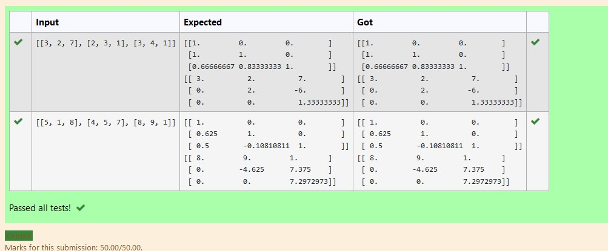
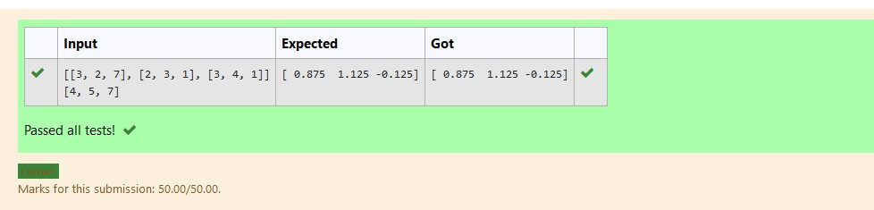

# LU Decomposition 

## AIM:
To write a program to find the LU Decomposition of a matrix.

## Equipments Required:
1. Hardware – PCs
2. Anaconda – Python 3.7 Installation / Moodle-Code Runner

## Algorithm
1.Define a function.

2.Get the values from the user. 

3.Compare the values to find the L and U of a matrix. 

4.Use for() and if() loop to find the LU Decomposition. 

## Program:
(i) To find the L and U matrix
```
/*
Program to find the L and U matrix.
Developed by:K.Sucharitha 
RegisterNumber:21002343
import numpy as np
import scipy
from scipy.linalg import lu
A =eval(input())
P,L,U=lu(A)
print(L)
print(U)
*/
```
(ii) To find the LU Decomposition of a matrix
```
/*
Program to find the LU Decomposition of a matrix.
Developed by:K.Sucharitha 
RegisterNumber:21002343
import numpy as np
from scipy.linalg import lu_factor,lu_solve
A =eval(input())
B =eval(input())
lu,piv= lu_factor(A)
x= lu_solve((lu,piv),B)
print(x) 
*/
```

## Output:




## Result:
Thus the program to find the LU Decomposition of a matrix is written and verified using python programming.

